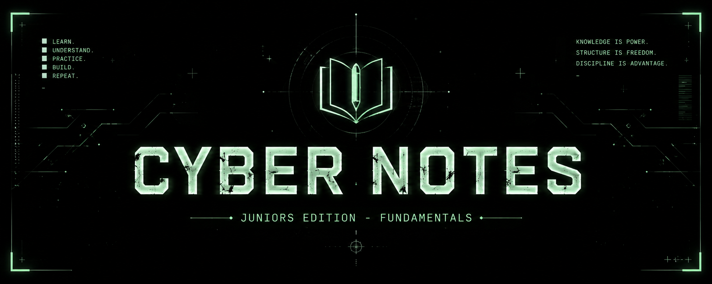
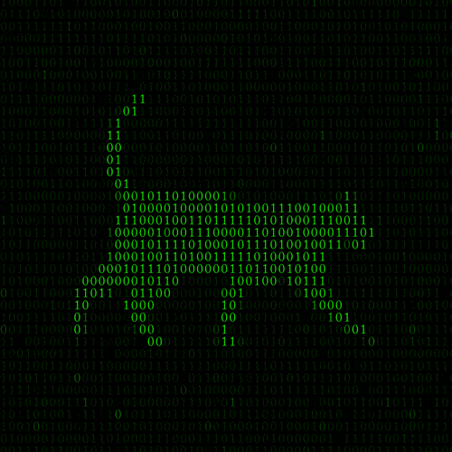

<div align="center">



<br>


<br><br>


<br>

`CYBERSECURITY` · `NETWORKING` · `LINUX` · `WEB` · `OFFENSIVE SECURITY`

</div>

---

<table>
<tr>
<td width="72%" valign="top">

# ABOUT

**Cyber Notes** is a personal cybersecurity knowledge vault created by **Rodrigo Tripa** for deeper study of the fundamentals required to enter cybersecurity.

This is **Cyber Notes v1.0 — Juniors Edition**, built primarily around knowledge acquired through **TryHackMe**, while also incorporating material from official documentation, RFCs, books, technical resources, and personal research.

The goal is not to reproduce courses or collect isolated answers. The vault is designed to turn beginner-level learning into a structured, reusable knowledge base that can continue to grow as new subjects are studied.

</td>

<td width="28%" align="center" valign="middle">


</td>
</tr>
</table>

---

# PURPOSE

Cyber Notes was created to provide a structured foundation for people who want to understand how computers, networks, operating systems, web technologies, and security mechanisms actually work before moving into more advanced security disciplines.

The current edition focuses on **junior-level fundamentals**, with enough breadth to support the knowledge expected from entry-level cybersecurity learners and to prepare for foundational certifications such as **TryHackMe SEC0 — Pre Security** and **SEC1 — Cyber Security 101**.

Networking receives particular attention because understanding communication, protocols, addressing, ports, traffic flow, and network architecture is fundamental to both offensive and defensive security.

The vault also goes beyond the minimum certification scope. It contains additional material intended for cybersecurity enthusiasts who want to develop a broader technical foundation rather than study only what is required to pass an exam.

---

# SECURITY FOCUS

```text
┌──────────────────────────────────────────────────────────────┐
│                                                              │
│  PRIMARY FOCUS        OFFENSIVE SECURITY                     │
│                                                              │
│  CORE                  NETWORKING · LINUX · WEB              │
│                        SYSTEMS · PROGRAMMING                 │
│                                                              │
│  SECONDARY             DEFENSIVE SECURITY · SOC              │
│                        SIEM · DETECTION · FORENSICS          │
│                                                              │
│  PHILOSOPHY            UNDERSTAND SYSTEMS                    │
│                        THEN LEARN HOW TO BREAK THEM          │
│                        THEN LEARN HOW TO DEFEND THEM         │
│                                                              │
└──────────────────────────────────────────────────────────────┘
```

The vault has a clear **offensive-security bias**, reflecting the author's main area of interest. This does not mean defensive security is ignored. Networking, operating systems, logs, SIEM concepts, defensive thinking, and other SOC-relevant subjects are included because offensive and defensive knowledge depend on the same technical foundations.

---

# WHAT'S INSIDE

<table>
<tr>
<td width="50%" valign="top">

### CORE FUNDAMENTALS

`01-Cybersecurity`

Security principles, attacker and defender mindsets, cryptography, offensive security, defensive security, SIEM and OWASP concepts.

`02-Networking`

Networking fundamentals, OSI and TCP/IP, LANs, DNS, DHCP, NAT, routing, switching, ports, packets and frames.

`03-Web`

HTTP, HTTPS, cookies, sessions, browsers, web architecture and websites.

`04-Computer-Fundamentals`

Computer architecture, CPU, RAM, storage, virtualization, cloud and client-server concepts.

</td>

<td width="50%" valign="top">

### SYSTEMS & DEVELOPMENT

`05-Operating-Systems`

Linux, Windows, CLI usage, permissions, filesystems, Active Directory, PowerShell and operating-system security.

`06-Programming`

Python, JavaScript, SQL, data representation and data encoding.

`07-Tools`

Practical documentation for security tools used throughout the learning process.

`11-Anonymity`

An independent knowledge area covering anonymity, privacy, threat modelling, operational security and traffic analysis.

</td>
</tr>
</table>

---

# TOOLS & PRACTICE

The vault contains dedicated documentation for tools commonly encountered during practical cybersecurity training.

```text
RECON / ENUMERATION       Nmap · Gobuster
WEB SECURITY              Burp Suite · SQLMap
PASSWORD ATTACKS          Hydra · John the Ripper
EXPLOITATION              Metasploit · Meterpreter · Msfvenom
TRAFFIC ANALYSIS          Wireshark · Tcpdump
MALWARE ANALYSIS          CAPA · REMnux · FlareVM
DATA ANALYSIS             CyberChef
```

Tool documentation is intentionally separated from quick-reference material. The objective is to understand what a tool does, why it is useful, and where it fits into a security workflow rather than turning the main tool notes into command dumps.

---

# KNOWLEDGE ORGANIZATION

Cyber Notes separates long-term knowledge from learning progress and practical reference material.

| Area | Purpose |
| --- | --- |
| `00-Resources` | Books, glossaries, external resources and learning material. |
| `01-Cybersecurity` | Core security concepts and principles. |
| `02-Networking` | Networking fundamentals and protocols. |
| `03-Web` | Web technologies and architecture. |
| `04-Computer-Fundamentals` | Computer and infrastructure fundamentals. |
| `05-Operating-Systems` | Linux, Windows and system security. |
| `06-Programming` | Programming and data concepts relevant to cybersecurity. |
| `07-Tools` | Tool documentation and practical context. |
| `08-Walkthroughs` | Practical machine and challenge walkthroughs. |
| `09-Cheatsheets` | Fast command and syntax references. |
| `10-Learning` | Learning progress and platform-specific notes. |
| `11-Anonymity` | Privacy, anonymity and operational-security research. |

The organization follows an **evergreen / Zettelkasten-inspired approach** where permanent concepts are kept separate from platform-specific learning progress whenever possible.

---

# LEARNING SOURCES

The knowledge in this vault is built from multiple sources, with **TryHackMe as the primary learning platform**.

```text
TRYHACKME
    │
    ├── Pre Security
    ├── Cyber Security 101
    ├── Practical Rooms
    └── Additional Learning Material
         │
         ├── Official Documentation
         ├── RFCs
         ├── Books
         ├── Technical Articles
         └── Personal Research / Experimentation
```

TryHackMe provides much of the practical learning path, while external sources are used to deepen concepts, verify technical details, and expand beyond the boundaries of individual rooms.

---

# TRYHACKME FOUNDATION

<table>
<tr>
<td width="50%" valign="top">

### SEC0 — PRE SECURITY

`FOUNDATIONAL`

The beginner foundation covering computer systems, operating systems, software, networking, the web, and basic attacks and defenses.

The corresponding knowledge is represented throughout the core sections of this vault rather than being kept as isolated course material.

</td>

<td width="50%" valign="top">

### SEC1 — CYBER SECURITY 101

`JUNIOR`

Builds on the fundamentals with broader cybersecurity knowledge across operating systems, networking, web security, offensive techniques and defensive concepts.

The learning progress and room summaries are maintained separately under:

`10-Learning/TryHackMe`

</td>
</tr>
</table>

> The vault is a study resource and is not affiliated with or endorsed by TryHackMe.

---

# OBSIDIAN VAULT

Cyber Notes was designed primarily to be **used and viewed as an Obsidian vault**.

The internal structure makes use of Markdown, folders, tags, metadata and Obsidian wikilinks to connect concepts together. The repository therefore represents more than a conventional documentation website: it is the source structure of a personal knowledge system.

For the best experience, clone the repository and open the project directory as an **Obsidian vault**.

---

# WEB VERSION

The vault can also be explored without Obsidian.

A continuously published version of the knowledge base is available through Rodrigo Tripa's website:

**[Open Cyber Notes →](https://rodrigotripa.dev/knowledge)**

The web version may differ slightly from the repository depending on the publication and synchronization process. The repository remains the primary source for the vault structure.

---

# VERSION 1.0

Cyber Notes v1.0 represents the **first edition of this knowledge collection**.

It is not intended to be a final cybersecurity curriculum. It is the first structured layer of a larger collection that can grow into more specialised editions covering progressively deeper areas of cybersecurity.

```text
CYBER NOTES
│
└── v1.0
    │
    └── JUNIORS EDITION
        │
        └── FUNDAMENTALS
             │
             ├── CYBERSECURITY
             ├── NETWORKING
             ├── WEB
             ├── SYSTEMS
             ├── PROGRAMMING
             └── SECURITY FOUNDATIONS
```

Future editions may expand into more advanced offensive security, defensive security, malware analysis, digital forensics, Active Directory, exploitation, detection engineering and other specialised areas.

---

# ROADMAP

```text
[✓] Build core cybersecurity fundamentals
[✓] Document networking fundamentals
[✓] Document Linux and Windows fundamentals
[✓] Document web fundamentals
[✓] Build initial security-tool documentation
[✓] Create practical cheatsheets
[✓] Integrate TryHackMe learning progress
[ ] Expand Active Directory
[ ] Expand privilege escalation
[ ] Expand web application security
[ ] Expand digital forensics
[ ] Expand malware analysis
[ ] Expand SOC / detection concepts
[ ] Expand advanced offensive security
```

Cyber Notes is intentionally maintained as a living knowledge base. Existing notes may be rewritten, expanded, reorganised or replaced as understanding improves.

---

# AUTHOR

<div align="center">


<br>

`RODRIGO TRIPA`

**CYBERSECURITY · OFFENSIVE SECURITY · LINUX**

<br>

*Understand systems. Study security. Keep building.*

</div>

---

# LICENSE

This project is distributed under the **MIT License**.

See [`LICENSE`](./LICENSE) for the full license text.

---

# DISCLAIMER

Cyber Notes is an educational knowledge base created for legitimate cybersecurity learning, research and experimentation.

Security techniques and tools documented here should only be used against systems and environments where you have explicit authorization.

Technical information may become outdated or contain mistakes. Important details should always be verified against current official documentation and other authoritative sources.

---

<div align="center">



<br>

`CYBER NOTES v1.0`

`JUNIORS EDITION · FUNDAMENTALS`

<br>

**Created by Rodrigo Tripa**

</div>
